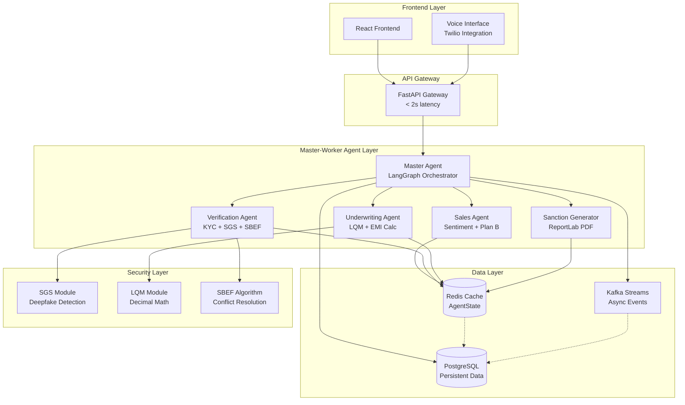
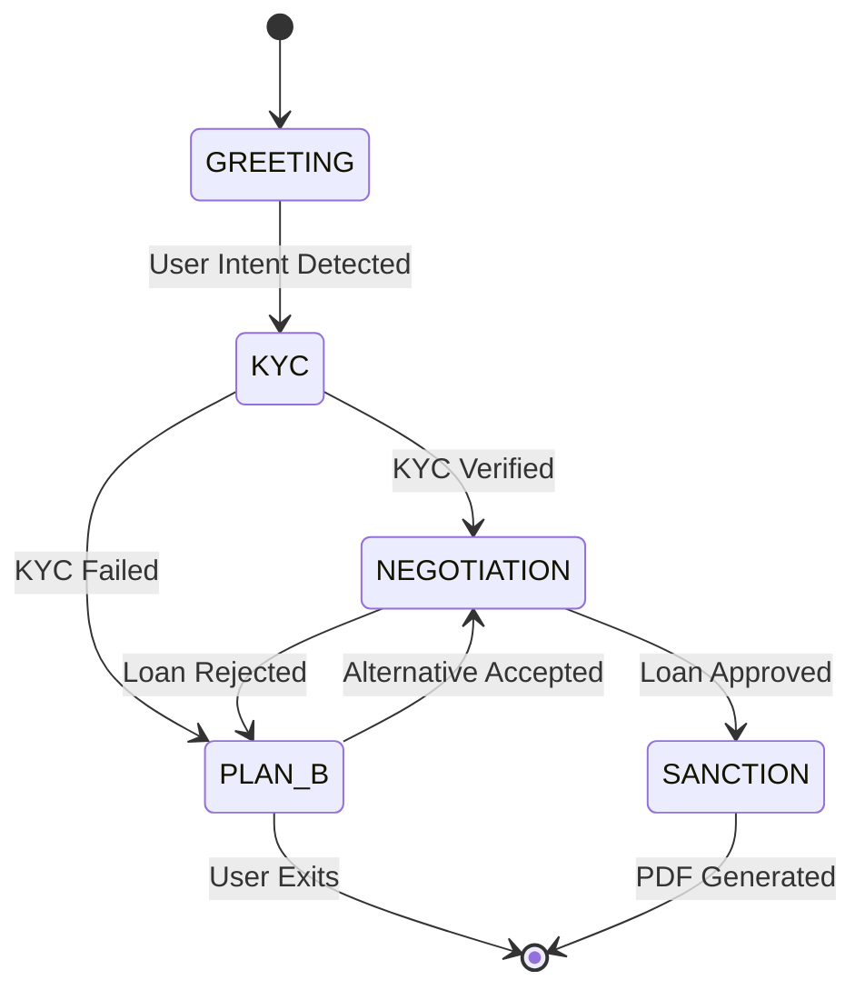
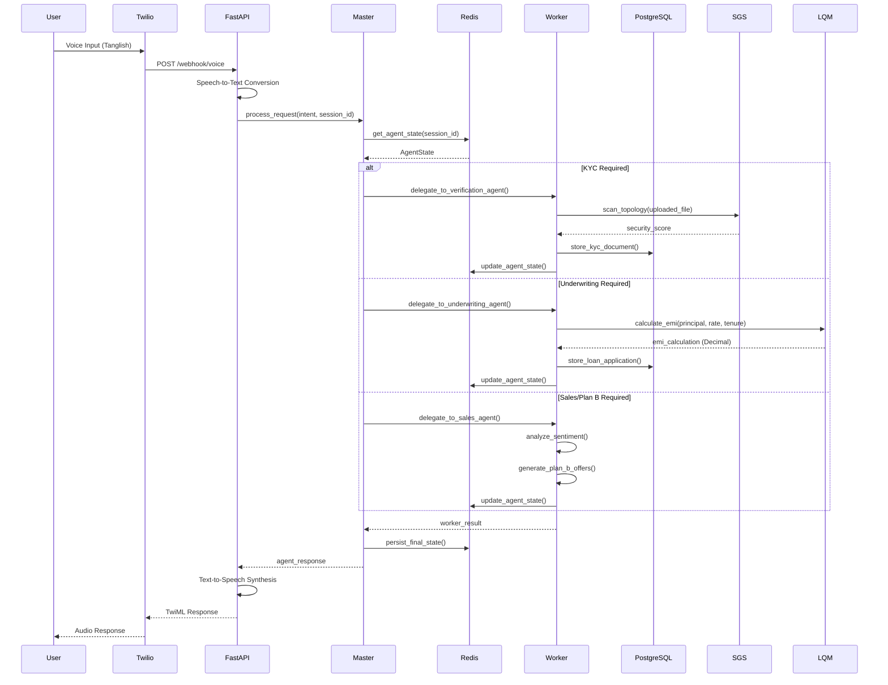

# Design Document: Loan2Day Agentic AI Fintech Platform

## Overview

Loan2Day implements a Hub-and-Spoke Agentic Architecture using LangGraph for orchestration, replacing traditional linear chatbot flows with a dynamic state machine. The system employs a Master-Worker pattern where a centralized Master Agent coordinates specialized Worker Agents (Sales, Verification, Underwriting) to process loan applications with empathy, security, and mathematical precision.

The architecture prioritizes zero-hallucination mathematics using decimal.Decimal, comprehensive security through SGS (Spectral-Graph Sentinel), and multilingual support for Tamil-English (Tanglish) speakers. The system maintains sub-millisecond response times through Redis caching and handles high-volume async processing via Kafka streams.

## Architecture

### High-Level System Architecture



### Agent State Machine



### Async/Sync Sequence Diagram



### Development Environment Setup

```bash
# 1. Create Virtual Environment targeting Python 3.11 LTS
python3.11 -m venv venv

# 2. Activate the Virtual Environment
# Linux/Mac:
source venv/bin/activate
# Windows:
# venv\Scripts\activate

# 3. Upgrade pip inside venv (NOT globally)
pip install --upgrade pip

# 4. Install dependencies locally in venv
pip install -r requirements.txt
```

# 5. initialize frontend project directory using npm cmd
npm create vite@latest frontend -- --template react-ts && cd frontend && npm install && npm install -D tailwindcss postcss autoprefixer && npx tailwindcss init -p && npm install react-router-dom @reduxjs/toolkit react-redux

### Project Structure

```
loan2day/
├── app/
│   ├── core/
│   │   ├── __init__.py
│   │   ├── config.py
│   │   ├── lqm.py          # Logic Quantization Module
│   │   ├── sgs.py          # Spectral-Graph Sentinel
│   │   └── mock_bank.py    # Mock Banking API
│   ├── agents/
│   │   ├── __init__.py
│   │   ├── master.py       # LangGraph Master Agent
│   │   ├── sales.py        # Sales Agent with Plan B
│   │   ├── verification.py # KYC & SGS Agent
│   │   └── underwriting.py # EMI & Risk Agent
│   ├── api/
│   │   ├── __init__.py
│   │   ├── routes/
│   │   │   ├── chat.py     # POST /v1/chat/message
│   │   │   ├── voice.py    # POST /webhook/voice
│   │   │   └── upload.py   # POST /v1/upload/kyc
│   │   └── main.py
│   ├── models/
│   │   ├── __init__.py
│   │   ├── pydantic_models.py
│   │   └── db_models.py
│   └── services/
│       ├── __init__.py
│       ├── voice_service.py
│       └── pdf_service.py
├── frontend/
│   ├── src/
│   │   ├── components/
│   │   │   ├── ChatWindow.jsx
│   │   │   ├── AudioRecorder.jsx
│   │   │   └── StatusBadge.jsx
│   │   ├── App.jsx
│   │   └── main.jsx
│   ├── package.json
│   └── vite.config.js
├── tests/
│   ├── unit/
│   ├── property/
│   └── integration/
├── requirements.txt
├── docker-compose.yml
└── README.md
```

## Components and Interfaces

### Master Agent (LangGraph Orchestrator)

**Purpose**: Centralized coordinator that manages session state and delegates tasks to Worker Agents without executing business logic directly.

**Key Responsibilities**:
- Route traffic based on user intent and current AgentState
- Maintain coordination between Worker Agents
- Handle graceful degradation and recovery
- Update AgentState after each Worker Agent completion

**Interface**:
```python
class MasterAgent:
    async def process_request(
        self, 
        session_id: str, 
        user_input: Dict[str, Any]
    ) -> AgentResponse
    
    async def delegate_to_worker(
        self, 
        agent_type: AgentType, 
        state: AgentState
    ) -> WorkerResult
    
    async def handle_state_transition(
        self, 
        current_state: AgentState, 
        transition: StateTransition
    ) -> AgentState
```

### Sales Agent (The Negotiator)

**Purpose**: Handles empathetic communication using sentiment analysis and implements Plan B logic for loan rejections.

**Key Responsibilities**:
- Perform real-time sentiment analysis on user input
- Maintain sentiment history for context awareness
- Trigger Plan B logic for alternative offers
- Maximize conversion through empathetic responses

**Interface**:
```python
class SalesAgent:
    async def analyze_sentiment(self, user_input: str) -> SentimentScore
    async def generate_empathetic_response(
        self, 
        sentiment: SentimentScore, 
        context: ConversationContext
    ) -> str
    async def trigger_plan_b(
        self, 
        rejection_reason: str, 
        user_profile: UserProfile
    ) -> List[AlternativeOffer]
```

### Verification Agent (The Detective)

**Purpose**: Handles KYC verification, fraud detection through SGS, and resolves data conflicts using SBEF algorithm.

**Key Responsibilities**:
- Process document uploads through SGS.scan_topology()
- Perform OCR extraction and validation
- Calculate fraud scores and trust scores
- Resolve conflicts between user input and document data

**Interface**:
```python
class VerificationAgent:
    async def process_kyc_document(
        self, 
        document: UploadedFile
    ) -> KYCResult
    
    async def calculate_fraud_score(
        self, 
        user_data: UserData, 
        document_data: DocumentData
    ) -> FraudScore
    
    async def resolve_data_conflict(
        self, 
        user_input: str, 
        ocr_output: str
    ) -> TrustScore
```

### Underwriting Agent (The Accountant)

**Purpose**: Performs risk assessment and EMI calculations using LQM module with zero-hallucination mathematics.

**Key Responsibilities**:
- Calculate EMI using reducing balance formula
- Perform risk assessment with decimal precision
- Store all monetary values as decimal.Decimal
- Validate calculations to 2 decimal places

**Interface**:
```python
class UnderwritingAgent:
    async def calculate_emi(
        self, 
        principal: Decimal, 
        rate: Decimal, 
        tenure: int
    ) -> EMICalculation
    
    async def assess_risk(
        self, 
        user_profile: UserProfile, 
        loan_request: LoanRequest
    ) -> RiskAssessment
    
    async def validate_loan_terms(
        self, 
        loan_details: LoanDetails
    ) -> ValidationResult
```

### Sanction Letter Generator

**Purpose**: Generates legally binding PDF documents using ReportLab upon loan approval.

**Key Responsibilities**:
- Generate PDF with verified data from AgentState
- Include regulatory disclosures and legal terms
- Provide secure download links
- Real-time generation upon approval

**Interface**:
```python
class SanctionGenerator:
    async def generate_sanction_letter(
        self, 
        loan_details: LoanDetails, 
        user_profile: UserProfile
    ) -> PDFDocument
    
    async def create_secure_download_link(
        self, 
        pdf_document: PDFDocument
    ) -> SecureURL
```

### Voice Interface (Polyglot Processor)

**Purpose**: Handles Tanglish (Tamil-English) speech processing through Twilio integration.

**Key Responsibilities**:
- Process mixed-language audio inputs
- Convert speech to structured JSON intent
- Synthesize agent responses back to audio
- Maintain language context throughout sessions

**Interface**:
```python
class VoiceInterface:
    async def process_tanglish_audio(
        self, 
        audio_stream: AudioStream
    ) -> JSONIntent
    
    async def synthesize_response(
        self, 
        text_response: str, 
        language_context: LanguageContext
    ) -> AudioStream
    
    async def handle_twilio_webhook(
        self, 
        webhook_data: TwilioWebhook
    ) -> TwilioResponse
```

## Data Models

### AgentState Schema

```python
from typing import Dict, List, Literal, Optional
from decimal import Decimal
from pydantic import BaseModel
from datetime import datetime

class AgentState(BaseModel):
    session_id: str
    user_id: str
    current_step: Literal["GREETING", "KYC", "NEGOTIATION", "SANCTION", "PLAN_B"]
    loan_details: Dict[str, Decimal]
    kyc_status: Literal["PENDING", "VERIFIED", "REJECTED"]
    fraud_score: float
    sentiment_history: List[str]
    trust_score: Optional[float] = None
    created_at: datetime
    updated_at: datetime
    
    class Config:
        json_encoders = {
            Decimal: str
        }
```

### Core Domain Models

```python
class UserProfile(BaseModel):
    user_id: str
    name: str
    phone: str
    email: str
    income_in_cents: Decimal
    employment_type: str
    credit_score: Optional[int] = None

class LoanRequest(BaseModel):
    amount_in_cents: Decimal
    tenure_months: int
    purpose: str
    requested_rate: Optional[Decimal] = None

class EMICalculation(BaseModel):
    principal_in_cents: Decimal
    rate_per_annum: Decimal
    tenure_months: int
    emi_in_cents: Decimal
    total_interest_in_cents: Decimal
    total_amount_in_cents: Decimal

class KYCDocument(BaseModel):
    document_type: str
    file_path: str
    ocr_text: str
    sgs_score: float
    verification_status: str

class SentimentScore(BaseModel):
    polarity: float  # -1 to 1
    subjectivity: float  # 0 to 1
    emotion: str
    confidence: float

class TrustScore(BaseModel):
    user_input_confidence: float
    ocr_confidence: float
    final_trust_score: float
    resolution_method: str
```

### Database Schema

```sql
-- Users table
CREATE TABLE users (
    id UUID PRIMARY KEY DEFAULT gen_random_uuid(),
    name VARCHAR(255) NOT NULL,
    phone VARCHAR(20) UNIQUE NOT NULL,
    email VARCHAR(255) UNIQUE NOT NULL,
    income_in_cents DECIMAL(15,2) NOT NULL,
    employment_type VARCHAR(100) NOT NULL,
    credit_score INTEGER,
    created_at TIMESTAMP DEFAULT NOW(),
    updated_at TIMESTAMP DEFAULT NOW()
);

-- Loan applications table
CREATE TABLE loan_applications (
    id UUID PRIMARY KEY DEFAULT gen_random_uuid(),
    user_id UUID REFERENCES users(id),
    amount_in_cents DECIMAL(15,2) NOT NULL,
    tenure_months INTEGER NOT NULL,
    purpose VARCHAR(255) NOT NULL,
    status VARCHAR(50) NOT NULL,
    fraud_score DECIMAL(5,4),
    trust_score DECIMAL(5,4),
    created_at TIMESTAMP DEFAULT NOW(),
    updated_at TIMESTAMP DEFAULT NOW()
);

-- Agent sessions table
CREATE TABLE agent_sessions (
    session_id UUID PRIMARY KEY DEFAULT gen_random_uuid(),
    user_id UUID REFERENCES users(id),
    current_step VARCHAR(50) NOT NULL,
    state_data JSONB NOT NULL,
    created_at TIMESTAMP DEFAULT NOW(),
    updated_at TIMESTAMP DEFAULT NOW()
);

-- KYC documents table
CREATE TABLE kyc_documents (
    id UUID PRIMARY KEY DEFAULT gen_random_uuid(),
    user_id UUID REFERENCES users(id),
    document_type VARCHAR(100) NOT NULL,
    file_path VARCHAR(500) NOT NULL,
    ocr_text TEXT,
    sgs_score DECIMAL(5,4),
    verification_status VARCHAR(50) NOT NULL,
    created_at TIMESTAMP DEFAULT NOW()
);

-- Indexes for performance
CREATE INDEX idx_users_phone ON users(phone);
CREATE INDEX idx_users_email ON users(email);
CREATE INDEX idx_loan_applications_user_id ON loan_applications(user_id);
CREATE INDEX idx_loan_applications_status ON loan_applications(status);
CREATE INDEX idx_agent_sessions_user_id ON agent_sessions(user_id);
CREATE INDEX idx_agent_sessions_current_step ON agent_sessions(current_step);
CREATE INDEX idx_kyc_documents_user_id ON kyc_documents(user_id);
```

### Requirements.txt (Python 3.11 LTS Compatible)

```txt
# Backend Framework
fastapi==0.104.1
uvicorn[standard]==0.24.0
pydantic==2.5.0
pydantic-settings==2.1.0

# Agent Orchestration
langgraph==0.0.62
langchain-core==0.1.10
langchain-community==0.0.10

# Database & Caching
asyncpg==0.29.0
sqlalchemy[asyncio]==2.0.23
alembic==1.13.1
redis[hiredis]==5.0.1

# AI/ML Libraries
numpy==1.24.4
torch==2.1.1
transformers==4.36.0

# PDF Generation
reportlab==4.0.7

# Voice Processing
twilio==8.10.0
speechrecognition==3.10.0
pydub==0.25.1

# Testing
pytest==7.4.3
pytest-asyncio==0.21.1
pytest-mock==3.12.0
hypothesis==6.92.1

# Development
python-dotenv==1.0.0
python-multipart==0.0.6
httpx==0.25.2
```

### Mock Banking Implementation

Since real banking APIs require extensive compliance and security clearances, the system implements a mock banking service that simulates:

- **Credit Score Lookup**: Returns realistic CIBIL scores (780 for good PANs, 550 for poor credit)
- **Bank Account Verification**: Simulates account validation responses
- **Transaction History**: Generates synthetic transaction patterns for risk assessment
- **Income Verification**: Mock salary account analysis

This allows full system testing while maintaining the exact same interfaces that would be used with real banking APIs.

## Correctness Properties

*A property is a characteristic or behavior that should hold true across all valid executions of a system—essentially, a formal statement about what the system should do. Properties serve as the bridge between human-readable specifications and machine-verifiable correctness guarantees.*

Based on the prework analysis and property reflection to eliminate redundancy, the following properties validate the core correctness requirements of the Loan2Day system:

### Property 1: Master Agent Coordination
*For any* user request and current AgentState, the Master Agent should route to the appropriate Worker Agent, update the state after completion, and maintain coordination without executing business logic directly.
**Validates: Requirements 1.1, 1.2, 1.3, 1.4**

### Property 2: Decimal Type Enforcement  
*For any* monetary calculation or storage operation, the system should use decimal.Decimal type and never use float for currency values, maintaining precision to exactly 2 decimal places.
**Validates: Requirements 4.1, 4.3, 4.4, 4.5, 7.2**

### Property 3: EMI Calculation Correctness
*For any* valid loan parameters (principal, rate, tenure), the LQM reducing balance EMI formula should produce mathematically correct results that match known reference calculations.
**Validates: Requirements 4.2**

### Property 4: SGS Security Processing
*For any* file upload, the system should pass the file through SGS.scan_topology() before any processing occurs, and generate appropriate security scores.
**Validates: Requirements 3.1, 8.2**

### Property 5: Agent State Persistence
*For any* state transition or worker agent completion, the AgentState should be updated with new data, persisted to Redis, and maintain all required fields (session_id, user_id, current_step, fraud_score, sentiment_history).
**Validates: Requirements 1.4, 7.1, 7.4, 7.6**

### Property 6: State Machine Validation
*For any* current step and transition request, the system should only allow valid state progressions (GREETING→KYC→NEGOTIATION→SANCTION, with PLAN_B as alternative path).
**Validates: Requirements 7.5**

### Property 7: KYC Status Management
*For any* KYC processing operation, the kyc_status should only contain valid enum values (PENDING, VERIFIED, REJECTED) and be updated appropriately based on verification results.
**Validates: Requirements 3.2, 7.3**

### Property 8: Sentiment Analysis Processing
*For any* user input text, the Sales Agent should generate sentiment scores and maintain sentiment history in the AgentState for context awareness.
**Validates: Requirements 2.1, 2.2**

### Property 9: Plan B Logic Activation
*For any* loan rejection scenario, the system should trigger Plan B logic to generate alternative offers rather than terminating the session.
**Validates: Requirements 2.3, 10.2**

### Property 10: SBEF Conflict Resolution
*For any* data conflict between user input and OCR output, the Verification Agent should use SBEF algorithm to calculate Trust_Score rather than rejecting the application outright.
**Validates: Requirements 3.6**

### Property 11: Voice Interface Processing
*For any* Tanglish audio input, the Voice Interface should convert speech to structured JSON intent and synthesize agent responses back to audio while maintaining language context.
**Validates: Requirements 5.1, 5.2, 5.3, 5.4**

### Property 12: API Input Validation
*For any* API request, the system should validate input using Pydantic models and return structured JSON responses with proper HTTP status codes.
**Validates: Requirements 6.4, 6.5**

### Property 13: Security Practices Enforcement
*For any* system component, there should be no hardcoded API keys (only environment variables), no print statements (only structured logging), and all sensitive operations should generate audit log entries.
**Validates: Requirements 8.1, 8.3, 8.5**

### Property 14: Async Database Operations
*For any* database I/O operation, the system should use async/await patterns and follow the Routes→Services→Repositories architectural pattern.
**Validates: Requirements 9.3, 9.4**

### Property 15: Error Handling Consistency
*For any* validation error or system failure, the system should return structured error responses with sufficient debugging context and handle graceful degradation.
**Validates: Requirements 10.1, 10.3, 10.4**

### Property 16: Session Recovery Capability
*For any* system restart or failure scenario, the AgentState should support session restoration from persisted data without data loss.
**Validates: Requirements 10.5**

### Property 17: PDF Generation Completeness
*For any* loan approval, the system should generate a PDF sanction letter using ReportLab with all required data fields (name, loan amount, EMI, interest rate) and regulatory disclosures, providing secure download links.
**Validates: Requirements 11.2, 11.3, 11.4, 11.5**

### Property 18: Twilio Integration Functionality
*For any* Twilio webhook request, the Voice Interface should handle telephony events correctly and maintain integration with Twilio Programmable Voice.
**Validates: Requirements 5.5**

## Error Handling

### Error Classification

The system implements a comprehensive error handling strategy with the following classifications:

1. **Validation Errors**: Input validation failures using Pydantic V2
2. **Business Logic Errors**: Loan rejection, KYC failures, fraud detection
3. **System Errors**: Database failures, external service timeouts, agent crashes
4. **Security Errors**: SGS scan failures, authentication issues, suspicious activities

### Error Response Format

All errors follow a consistent JSON structure:

```python
class ErrorResponse(BaseModel):
    error_code: str
    error_message: str
    error_details: Dict[str, Any]
    timestamp: datetime
    session_id: Optional[str] = None
    trace_id: str
```

### Graceful Degradation Strategy

1. **Agent Failures**: Master Agent handles worker failures by retrying with exponential backoff
2. **External Service Failures**: Fallback to cached data or alternative processing paths
3. **Database Failures**: Redis cache serves as temporary fallback for session data
4. **Plan B Logic**: Loan rejections trigger alternative offer generation instead of termination

### Recovery Mechanisms

1. **Session Recovery**: AgentState persisted in Redis enables session restoration
2. **Circuit Breaker**: External service calls protected by circuit breaker pattern
3. **Dead Letter Queue**: Failed Kafka messages routed to DLQ for manual processing
4. **Health Checks**: Comprehensive health endpoints for monitoring system status

## Testing Strategy

### Dual Testing Approach

The system employs both unit testing and property-based testing as complementary approaches:

- **Unit Tests**: Verify specific examples, edge cases, and integration points
- **Property Tests**: Verify universal properties across all inputs through randomization
- **Together**: Provide comprehensive coverage where unit tests catch concrete bugs and property tests verify general correctness

### Property-Based Testing Configuration

- **Library**: Hypothesis for Python property-based testing
- **Iterations**: Minimum 100 iterations per property test due to randomization
- **Tagging**: Each property test tagged with comment referencing design document property
- **Tag Format**: `# Feature: loan2day, Property {number}: {property_text}`

### Unit Testing Focus Areas

Unit tests should concentrate on:
- Specific examples demonstrating correct behavior
- Integration points between Master Agent and Worker Agents
- Edge cases in EMI calculations and fraud scoring
- Error conditions and Plan B logic scenarios
- Twilio webhook handling and voice processing

### Property Testing Focus Areas

Property tests should verify:
- Universal mathematical correctness (EMI calculations, decimal precision)
- State machine transitions and data consistency
- Security processing (SGS scanning, SBEF conflict resolution)
- Agent coordination and state persistence
- API validation and response formatting

### Test Data Management

- **Synthetic Data**: Generate realistic loan applications and user profiles
- **Mock Services**: Mock external services (Twilio, SGS, OCR) for isolated testing
- **Test Fixtures**: Predefined AgentState scenarios for consistent testing
- **Security Testing**: Include tests for fraud detection and deepfake scenarios

### Performance Testing

- **Load Testing**: API Gateway latency under high concurrent load
- **Stress Testing**: Agent coordination under system resource constraints
- **Endurance Testing**: Long-running sessions with state persistence
- **Latency Testing**: Voice interface response times for natural conversation flow